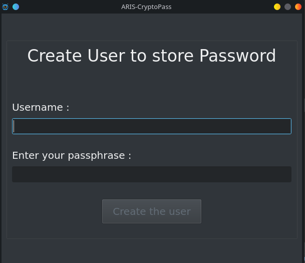
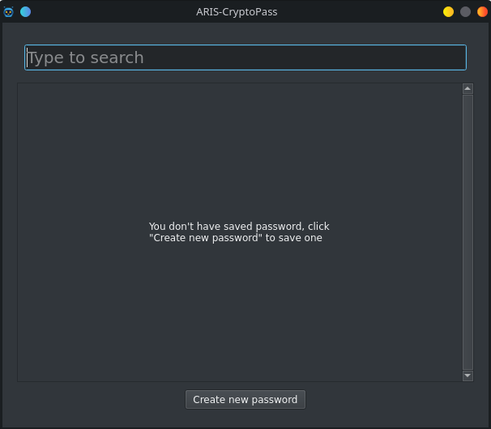

# ARIS-CryptoPass

ARIS-CryptoPass is a little software to save Password and Credit Cards, connection free, highly secure with your own passphrase.
The encrypted file will be save on your desktop, no cloud saving ! 
When saving Password you can use the very strong suggested password :wink:

# Table of contents

- [Usage](#usage)
- [Installation For Linux](#installation-for-linux)
- [Installation For Windows](#installation-for-windows)

 # Usage

[(Back to top)](#table-of-contents)

- Launch ARIS-CryptoPass and create user, you should use a very strong passphrase and never forget it : 

  

- The Password Screen, on the top you have an input to search in the password list : 

  

- Click on Create new password to save new password or credit cards :

   

- How to fill the Create Password Screen : 
  1) Fill the Website input with name of the Website ("Github", "Gmail", "Youtube", ...)
  2) Fill the Username input with the username
  3) You can use the Suggested Password or enter your own password
  
- How to fill the Create Credit Cards Screen : 
  1) Fill the Bank Name input with name of the Bank
  2) Fill the Cards Number input with the number of the cards
  3) Fill the Date and code input with the expiration date and code of the cards ("xx/xx xxx") 

- Password and Credit Cards screen :

  
  
  1) You can use the "Show" button to show the username and password and "Hide" to hide it
 
    
    
  2) You can use the X to delete a saved password or credit cards

- When you reduce or close ARIS-CryptoPass you will have it on your System Tray (little robot head)

  
  
  1) Left-Click on the robot head => reopen ARIS-CryptoPass
  2) Right-Click on the robot head => open menu and select close to close ARIS-CryptoPass

- When you relaunch ARIS-CryptoPass after saving : 

   

# Installation For Linux

[(Back to top)](#table-of-contents)

1. Copy the GitHub project to any folder :

 `git clone https://github.com/Alastyn08/ARIS-CryptoPass.git`
 
2. Go to the data folder and modify the "ARIS-CryptoPass.desktop"
 
 `sudo nano data/ARIS-CryptoPass.desktop`

3. Modify the 4th line : 

 `Exec=python3 PATH_TO_ARIS-CRYPTOPASS/ARIS-CryptoPass/launch.py`

4. Launch the setup.py file :

 `sudo python3 setup.py install`

5. ARIS-CryptoPass should be available on /usr/share/applications :

Launch this to create link to your desktop : 
 
 `ln -s /usr/share/applications/ARIS-CryptoPass.desktop ~/Desktop/ARIS-CryptoPass.desktop`

or if the "~" don't work :
 
 `ln -s /usr/share/applications/ARIS-CryptoPass.desktop YOUR_HOME_DIRECTORY/Desktop/ARIS-CryptoPass.desktop`
 
or if the Desktop is Bureau :

 `ln -s /usr/share/applications/ARIS-CryptoPass.desktop ~/Bureau/ARIS-CryptoPass.desktop`

Your good to go :smile:
If you have any issue, fell free to create an issue.

# Installation For Windows (not yet available)

[(Back to top)](#table-of-contents)

You can find the setup file in the Setup Folder, just need to launch it and install ARIS-CryptoPass :wink:

There is an issue with the Windows 10, the app don't want to go to the system tray => need to kill the app in the proccess 😧

